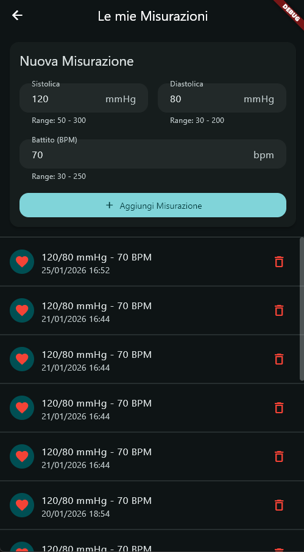
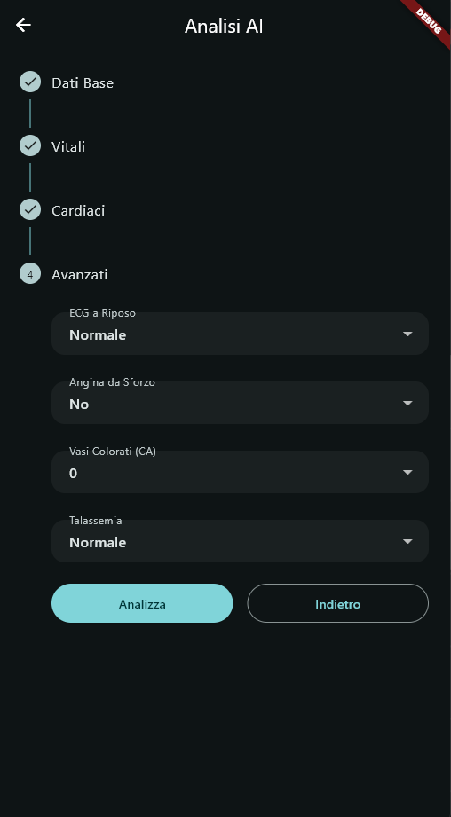
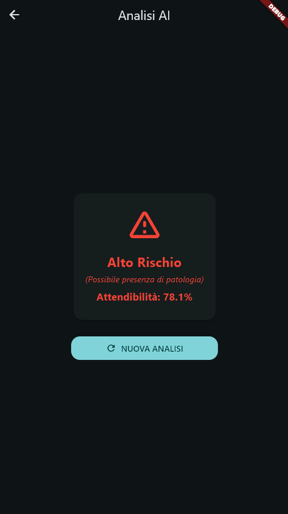
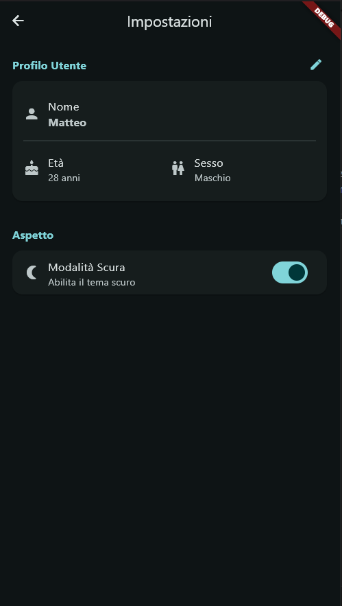

Matricola: 342924 

Nome: Matteo Pulcinelli
---
# CardioGuard – Misurazioni di pressione arteriosa e battito  con analisi tramite modello di regressione logistica su servizio remoto

### Panoramica del Progetto
CardioGuard è un'applicazione sviluppata in Dart con Flutter che consente agli utenti di monitorare la propria salute cardiaca. L'utente ha a disposizione due funzionalità principali:
*   **Misurazioni**: registrare i propri parametri  (pressione e battito) nel tempo.
*   **Analisi AI**: utilizzare un sistema di classificazione basato su regressione logistica per valutare il   rischio di malattie cardiache.

L'applicazione è multipiattaforma e supporta Android e Windows.

Le schermate sono quattro:
*   **Home**: pagina principale. Fornisce accesso alle funzionalità principali. Inoltre, è presente un widget dedicato alla qualità dell'aria basato sulla posizione GPS attuale dell'utente.
*   **Misurazioni**: sezione dedicata dove gli utenti possono aggiungere, visualizzare ed eliminare le proprie misurazioni sanitarie giornaliere (es. pressione sanguigna, frequenza cardiaca). I dati vengono salvati localmente e persistono tra le sessioni.
*   **Analisi AI**: sezione dove gli utenti inseriscono i propri dati clinici (età, colesterolo, tipo di dolore toracico, ecc.). Questi dati vengono inviati a un server remoto che li elabora e restituisce una valutazione del rischio (basso/alto rischio e percentuale di confidenza).
*   **Impostazioni**: schermata di configurazione che permette di impostare il profilo utente e selezionare il tipo di tema (chiaro o scuro) dell'applicazione.

## **User Experience**

L'applicazione è progettata per essere intuitiva. Di seguito vengono riportate le operazioni principali:

1.  **Monitoraggio della Pressione**: Dalla Home, l'utente accede alla sezione "Le Mie Misurazioni". Qui compila un form (Sistolica, Diastolica, Battiti). Al salvataggio, la lista delle misurazioni si aggiorna istantaneamente mostrando la nuova voce in cima allo storico.
2.  **Percorso di Diagnosi AI**: L'utente viene guidato attraverso uno *Stepper* in 4 fasi. Questa suddivisione in categorie logiche (Dati Base, Parametri Vitali, Cardiaci, Esami Avanzati) rende la compilazione dei parametri clinici fluida e riduce gli errori grazie alla validazione in tempo reale per ogni step.
3.  **Gestione Preferenze**: Tramite uno switch nelle impostazioni, l'utente può passare dalla modalità chiara a quella scura del tema. Il profilo utente può essere modificato direttamente passando dalla visualizzazione alla modifica con un singolo tasto.

<table align="center">
  <tr>
    <td align="center">
      
       
      <b>Dashboard Principale</b> Monitoraggio AQI e bottoni di navigazione
    </td>
    <td align="center">
      
       
      <b>Registro Misurazioni</b> Form inserimento e storico pressione e battito
    </td>
  </tr>
  <tr>
    <td align="center">
      
       
      <b>Analisi AI</b> Valutazione rischio cardiaco
    </td>
    <td align="center">
      
       
      <b>Risposta AI</b> Esito della diagnosi
    </td>
  </tr>
  <tr>
    <td colspan="2" align="center">
      
       
      <b>Impostazioni</b> Gestione utente e tema
    </td>
  </tr>
</table>

### Librerie Utilizzate

Per la realizzazione del progetto sono state utilizzate diverse librerie qui di seguito riportate:
*   **flutter_riverpod**: usato per lo state management; consente di centralizzare lo stato e gestire in modo asincrono i dati (loading/error/data).
*   **sqflite**: implementa un database SQLite locale per archiviare le misurazioni dell'utente da poter poi consultare in qualsiasi momento.
*   **sqflite_common_ffi**: usato su Windows per abilitare SQLite su desktop (inizializzazione FFI del database).
*   **http**: gestisce le richieste di rete verso il servizio AI in Python e le API esterne per la qualità dell'aria.
*   **shared_preferences**: utilizzato per salvare le impostazioni utente semplici e  preferenze sul tema (chiaro/scuro).
*   **geolocator**: recupera le coordinate del dispositivo per ottenere dati sulla qualità dell'aria nel luogo in cui si trova l'utente.
*   **window_manager**: consente di impostare le dimensioni minime della finestra su desktop.

## **Scelte implementative**
* **Separazione della logica dati (measurement repository)**: le operazioni sul database delle misurazioni (insert/read/delete) sono incapsulate in _MeasurementRepository_, così la UI non comunica direttamente con SQLite.
* **Gestione dello stato con Riverpod**: uso _AsyncNotifier_ per la lista delle misurazioni e per la diagnosi AI, in modo da gestire loading / errore / dati e aggiornare la UI automaticamente.
* **Preferenze (SharedPreferences)**: _SharedPreferences_ viene inizializzato in _main()_ prima di _runApp()_ e passato ai provider tramite _ProviderScope(overrides: ...)_, così tema e profilo utente sono leggibili senza schermate di caricamento.
* **Interfaccia adattiva**: layout che cambia in base all’orientamento e, su schermi grandi, viene fatto uno scaling tramite _FittedBox_ nel _builder_ di _MaterialApp_.

## **Problemi riscontrati e soluzioni**

**Preferenze sincrone per la UI (tema, impostazioni)**

  * **Problema**: _SharedPreferences.getInstance()_ è asincrono. Inizializzare tema e profilo in modo async, richiede la gestione di _AsyncValue_ (loading/error) anche per leggere tema e profilo, aggiungendo complessità alla UI.
  * **Soluzione**: inizializzo _SharedPreferences_ nel _main()_ prima di _runApp()_ e lo passo ai provider con _ProviderScope(overrides: ...)_, così tema e profilo sono disponibili subito senza _await_ o _FutureBuilder_.

 **SQLite su Windows**

  * **Problema**: usando _sqflite_ su Windows ho avuto limiti/problemi di inizializzazione.
  * **Soluzione**: ho usato _sqflite_common_ffi_ con _sqfliteFfiInit()_ e _databaseFactoryFfi_ per far funzionare correttamente il database su desktop.

**Validazione stepper (diagnosis_screen)**

  * **Problema**: senza validazione per step l’utente poteva andare avanti anche con campi vuoti.
  * **Soluzione**: ho usato un _Form_ per ogni step con _GlobalKey<FormState>_ e blocco l’avanzamento con _validate()_

**Ripetizione dei campi di input nella schermata di diagnosi**

  * **Problema**: la gestione di numerosi _TextFormField_ simili comportava codice duplicato e difficile da manutenere; ogni modifica allo stile richiedeva aggiornamenti manuali su più widget.
  * **Soluzione**:  creazione di _CustomTextField_, un widget riutilizzabile che centralizza logica e design, riducendo le ripetizioni e facilitando modifiche globali.

**Adattabilità dell'interfaccia su schermi grandi**

  * **Problema**: su schermi ampi, il layout da mobile risultava troppo dispersivo, con elementi piccoli e molto spazio bianco inutilizzato.
  * **Soluzione**: ingrandimento del layout nel builder di MaterialApp quando la larghezza supera un breakpoint definito.
